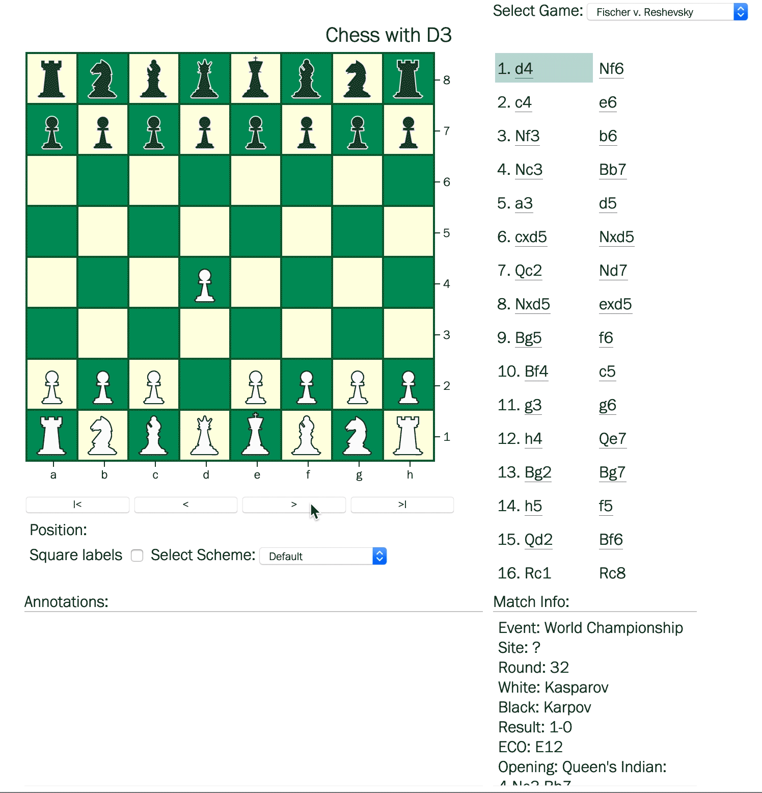

## Creating chess with D3

An exploration of building a chess viewer for play-throughs and reading match annotations.  

Development notes about building [chess in d3](https://matthewdhull.github.io/chess/) 

