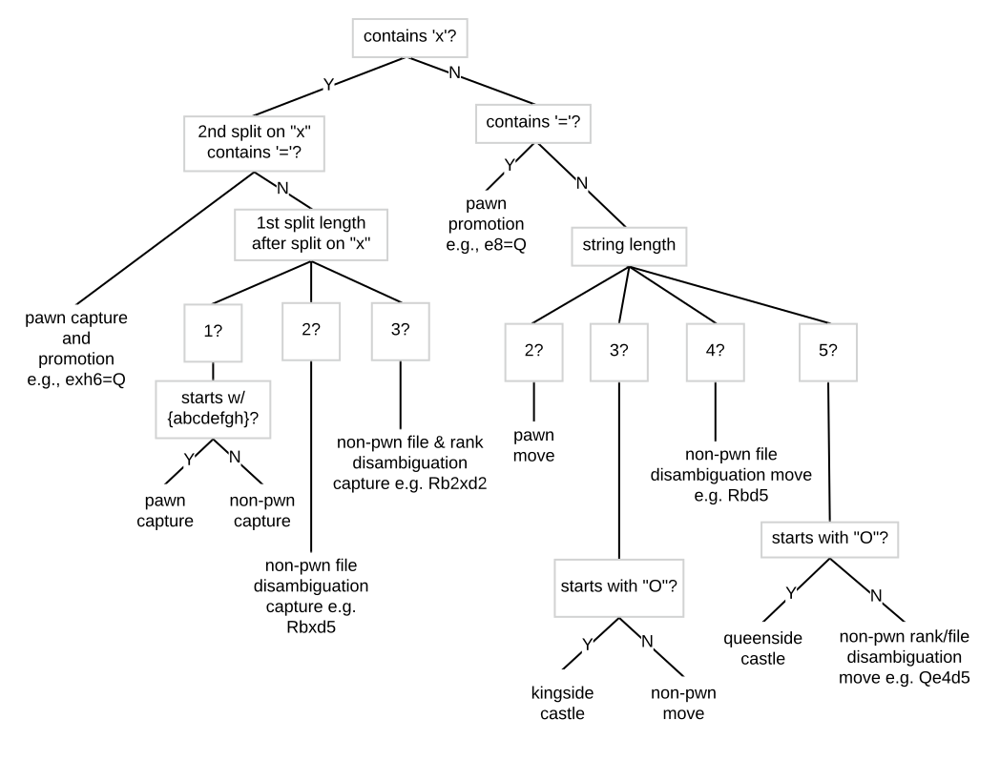
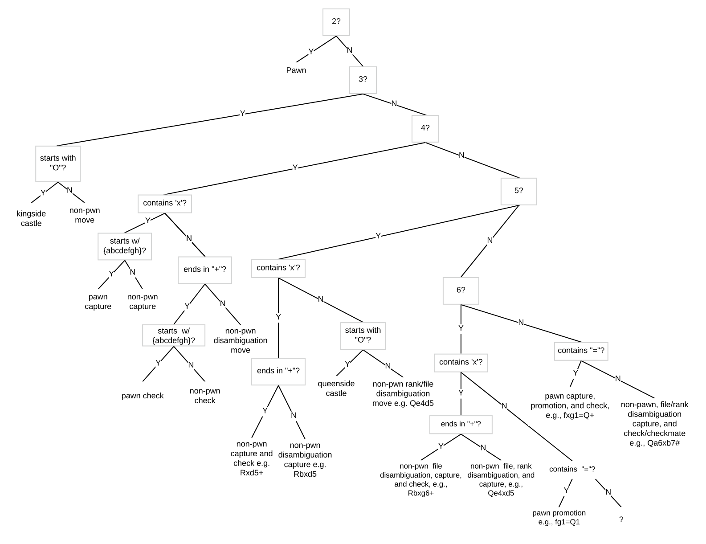
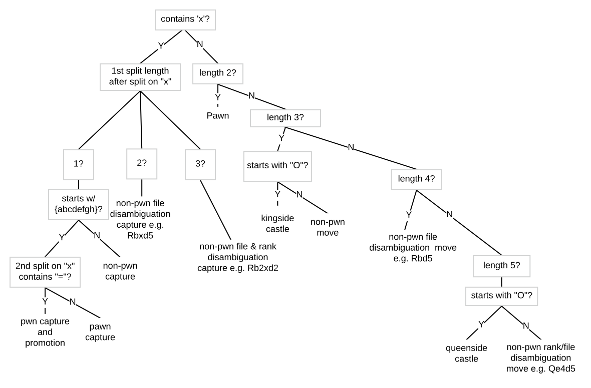
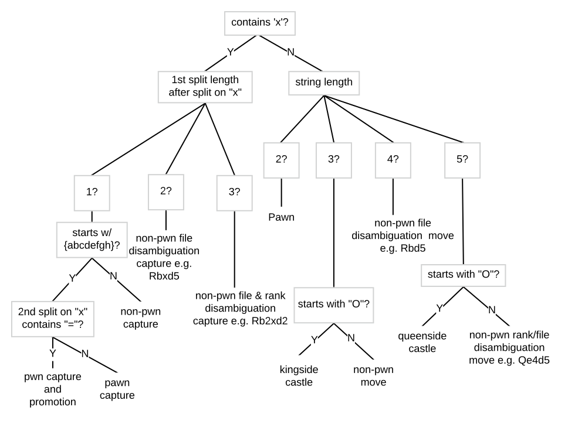

### Parsing SAN (Standard Algebraic [chess] Notation)

### SAN parsing tree
Current version

(previous attempts shown below)

### Take 1 at a parsing tree
Using length of a single move in SAN as base case

### Take 2 at a parsing tree
Root of tree checks for whether or not the move is a capture, disregards cases of check/checkmate

### Take 3 at a parsing tree
level 2 branches check the string length for greater simplification.  
