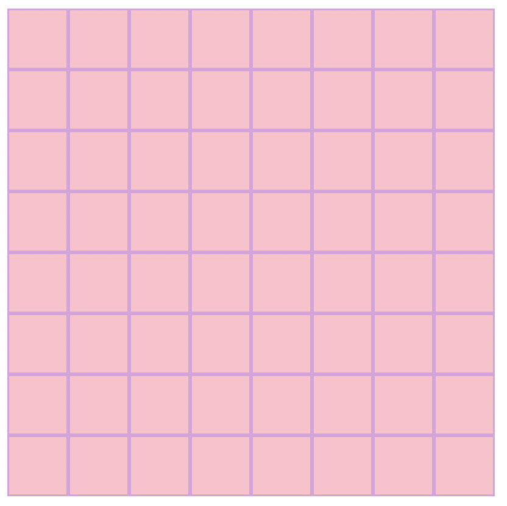
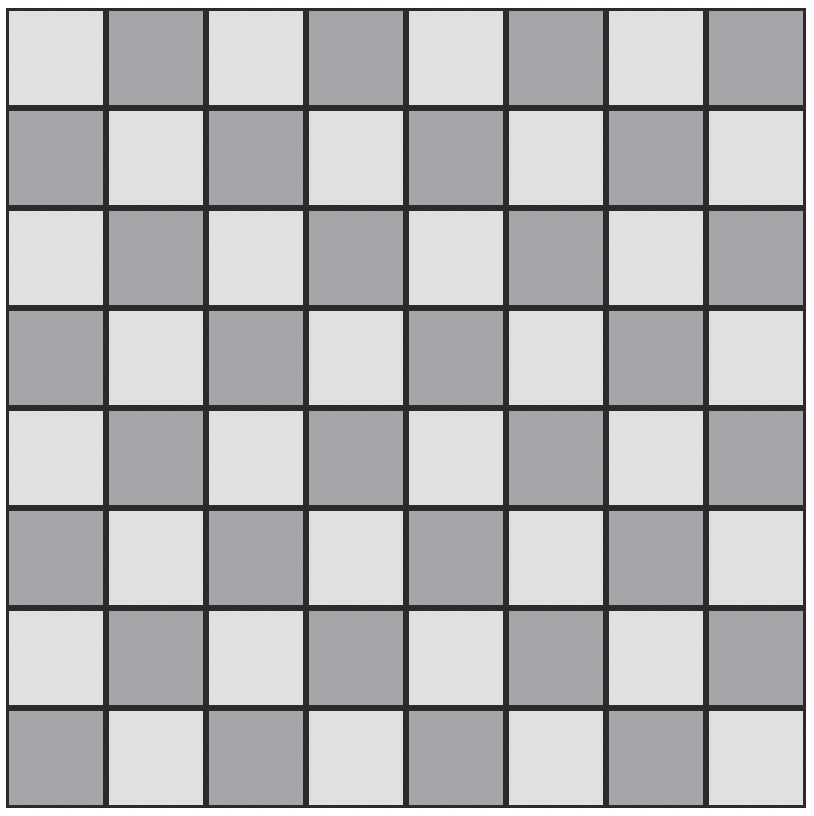
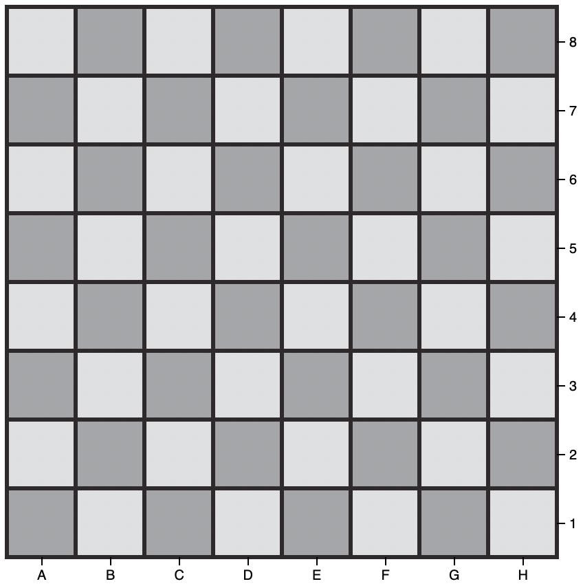
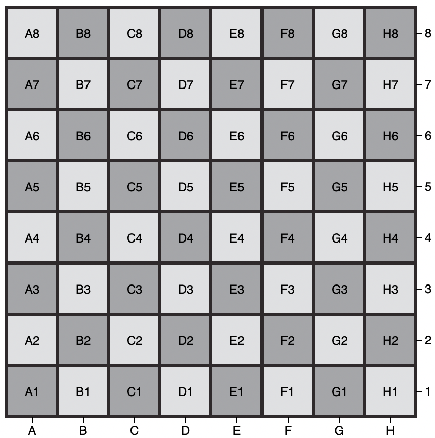
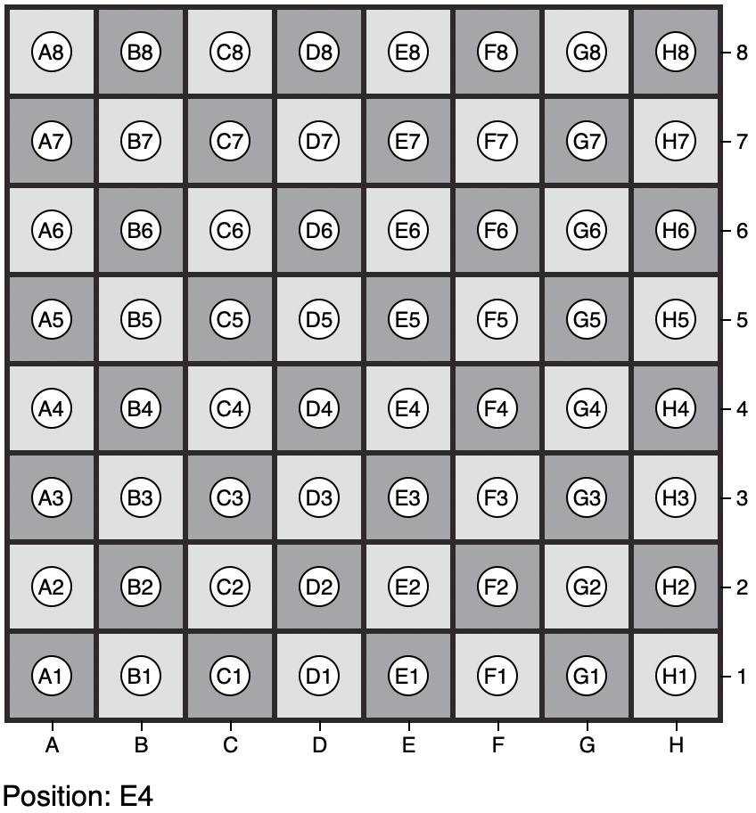
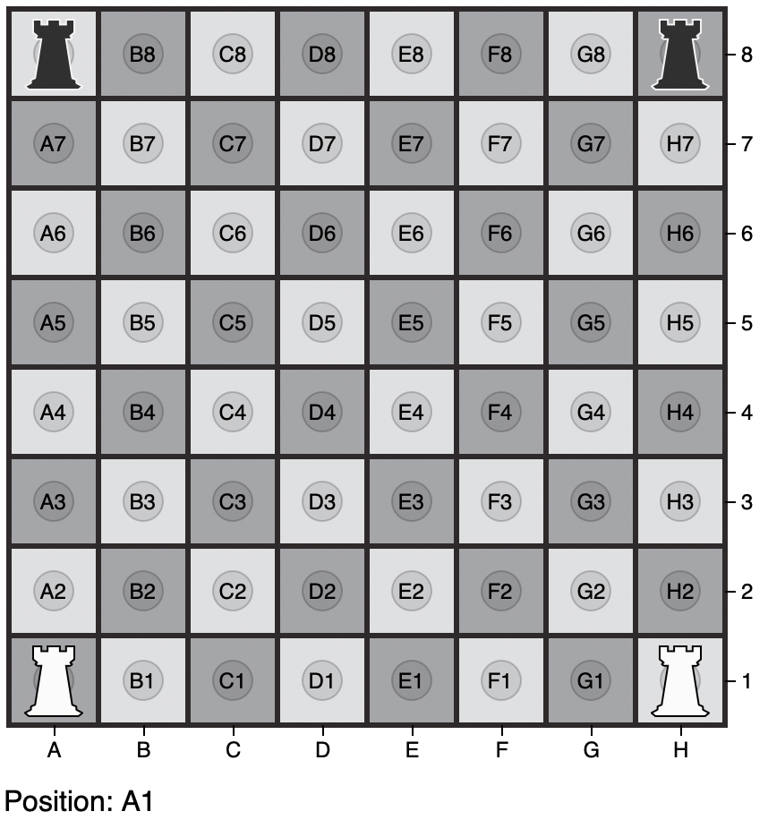

## Building the basic board - 29 NOV 20

Commit [85cd95](https://github.com/matthewdhull/chess/commit/85cd7955bf602cd0f36232d0edbad500f6ee738d)

### - With alternating colors - 30 NOV 20

Colors chosen from the [swiss style color picker](https://fabianburghardt.de/swisscolors/)

Commit [51168e4](https://github.com/matthewdhull/chess/commit/51168e44bf5d38d061212f6cda297b08eb3b67e2)

### - x and y axes indicate board positions

Commit [ac258a6](https://github.com/matthewdhull/chess/commit/ac258a6106e9dcafd08baef30f54c5341477279f)

### - Full board position annotation added

- Plan to add visibility toggle for board positions

Commit [45799c7](https://github.com/matthewdhull/chess/commit/4b799c7363b5dfd92fa251000c150dbd21085c79)

### - Square Center Annotations
 - Hover-over square shows board position

Commit [27c1aab](https://github.com/matthewdhull/chess/commit/27c1aab3420bddc38086edd7cd4af7d5e200872f)

### - Piece path and positioning
- Using `pieces.js` to hold the `d` value to specify the path to be drawn for a piece.  We start by drawing a rook.  To position the it, we use the `positions` dictionary and get the coordinates for where to  place the rook path within the `svg` element.

Getting the position
`	
	x = positions["A8"][0]
	y = positions["A8"][1]
`

Commit [84165e](https://github.com/matthewdhull/chess/commit/84165edbb1bde518ce159414c029993594ffac48)