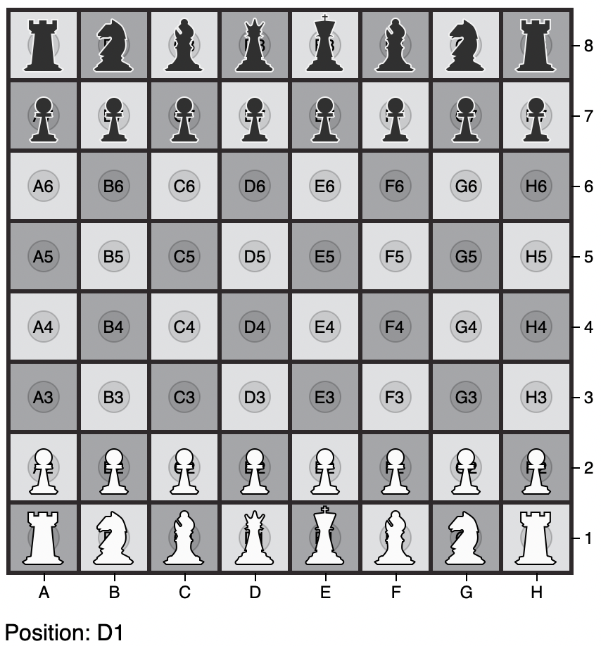
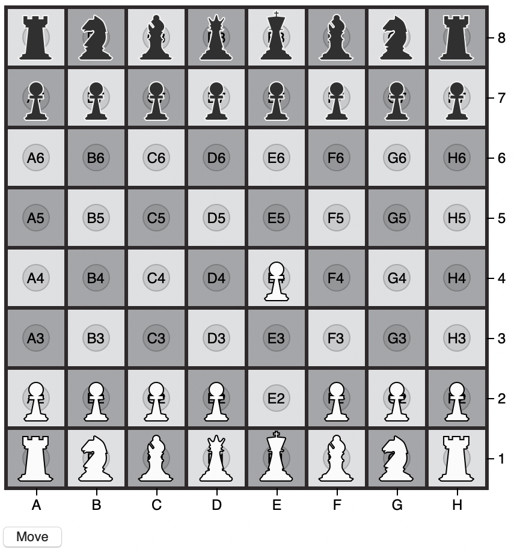
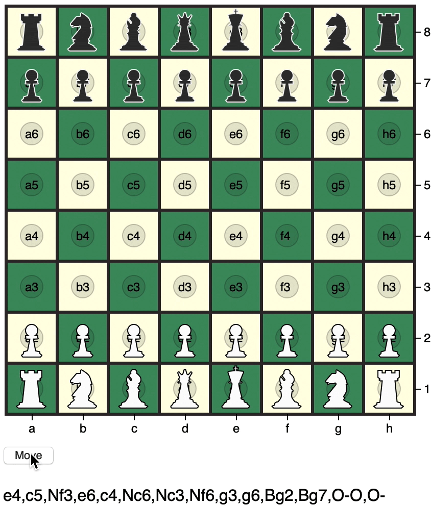

## Building the basic board - 29 NOV 20


Commit [85cd95](https://github.com/matthewdhull/chess/commit/85cd7955bf602cd0f36232d0edbad500f6ee738d)

### - With alternating colors - 30 NOV 20


Colors chosen from the [swiss style color picker](https://fabianburghardt.de/swisscolors/)

Commit [51168e4](https://github.com/matthewdhull/chess/commit/51168e44bf5d38d061212f6cda297b08eb3b67e2)

### - x and y axes indicate board positions


Commit [ac258a6](https://github.com/matthewdhull/chess/commit/ac258a6106e9dcafd08baef30f54c5341477279f)

### - Full board position annotation added

- Plan to add visibility toggle for board positions


Commit [45799c7](https://github.com/matthewdhull/chess/commit/4b799c7363b5dfd92fa251000c150dbd21085c79)

### - Square Center Annotations
 - Hover-over square shows board position


Commit [27c1aab](https://github.com/matthewdhull/chess/commit/27c1aab3420bddc38086edd7cd4af7d5e200872f)

### - Piece path and positioning
- Using `pieces.js` to hold the `d` value to specify the path to be drawn for a piece.  We start by drawing a rook.  To position the it, we use the `positions` dictionary and get the coordinates for where to  place the rook path within the `svg` element.

Getting the position:

```javascript
x = positions["A8"][0]
y = positions["A8"][1]
```


Commit [b61e48f](https://github.com/matthewdhull/chess/commit/b61e48f98534bceeb376048c64415a57f128b5b6)


### - Remaining Pieces, re-factored initial piece layout
- All piece types (king, queen, bishop, knight, rook, pawn) have a defined path in `pieces.js`.  We store a piece's information in the `start_positions` dictionary and use this data in our `d3.selectAll("path")...` call.  

e.g., Black's Queen Rook is named "bqr" and has the following data: 


```
"bqr":{
	"path": rook_path
	, "position": "A8"
	, "fill": black_piece_fill
	, "stroke": black_piece_stroke }
```
						
and append as seen [here](https://github.com/matthewdhull/chess/blob/44f5efe90eef3ee326224ad0e1cd50baf7cd25d8/board.html#L171)



Commit [44f5efe](https://github.com/matthewdhull/chess/commit/44f5efe90eef3ee326224ad0e1cd50baf7cd25d8)
						
						
### Exploring Piece Movement

By using D3's `.transition()` function, let's  explore how animate  the movement of a piece to a new position.   For this example, we move white's king pawn `wkp` to E4.  

Bind the movement event to a button so we can control when the  move is triggered. 
 
`d3.select("#start").on("click", function() {...}`

We can access the coordinates of E4 as:

`var newPosition = positions["E4"]`

Then, select `wkp` and assign the E4 position to the pieces transform translation attribute.  To animate this position change, use the  `.transition())` function before assigning the new translation. 

```javascript
d3.select("#wkp")
    .transition()
    .attr("transform", "translate("+(newPosition[0]-25)+","+
(newPosition[1]-24)+")")
```

[full code](https://github.com/matthewdhull/chess/blob/9c2f5950a3ebfce514cbc1a015da841276a030af/board.html#L213)



Commit [9c2f595](https://github.com/matthewdhull/chess/commit/9c2f5950a3ebfce514cbc1a015da841276a030af)

### Reading Portable Game Notation (pgn) 



The [pgn](https://opensource.apple.com/source/Chess/Chess-110.0.6/Documentation/PGN-Standard.txt) format is widely used to notate the plays in a game of chess.  It seems natural to use pgn files to drive the movement of pieces in the visualization since adopting this standard would permit us to visualize any game.  While pgn is designed to be human-readable and easily read by computers, there are tradeoffs in the data representation that require some extra work to translate the notation of a given move into an action to drive the visualization.

#### Interpreting the pgn format

A move described in `pgn` contains implicit meaning:
*e.g*. 
- `e4` implies to move a white or black pawn to the `e4` square.  In the opening moves of the game, only white's king pawn can make this move.   
- `Nf3` implies to move a white or black knight to the `f3` square.

Within the `.pgn` file, the moves are given as pairs. Since white always begins the game we can read a move as follows:

`1. e4 c5` means that white opens by moving their king pawn to e4 and black responds by moving their queen's bishop pawn to c5.   

#### Obtaining and parsing

For our datasource, we [Chess Microbase](https://chessmicrobase.com/microbases/10?token=1koly5lq) for its 1000 publicly available games for download in the .pgn format.  This project starts with [Brown vs. Quinteros](https://chessmicrobase.com/microbases/10/games/709?token=1koly5lq)

Parsing the entire `.pgn` is beyond the scope of this project and there are already many excellent solutions available.   We choose [Aditya DS's](https://github.com/Aditya-ds-1806) excellent [Chess PGN Parser](https://aditya-ds-1806.github.io/Chess-PGN-Parser/#/) for its ability to parse a `.pgn` into `.json`. (the format used for this project) 

#### Translating Implicit Moves

All moves are stored in the `moves` array.  
```javascript
const moves = ["e4", "c5", "Nf3","Kf3"]  
```
We deduce white's turn or black's turn by the index of the move:

```javascript
if (index % 2 == 0) {
    // white's move
}
```

While the goal is to let `d3` use a `.pgn` game file and drive the placement and movement of pieces within the DOM, we don't have enough information for parsing a move like `Nf3`.  
- Which of the four knights is moving to "f3"?  
- What is the starting square?  
While trying to avoid tracking the entire board state, we use make use of a utility function that returns the possible moves for each knight on the board. 

```javascript
// get the moves for the knight on square g1 
const potentialMoves = knightMoves("g1")  
// returns ["e2","f3","h3"]
```   
Iterate through the potential moves for each knight and determine whether or not it contains "f3".  In this case, white's king knight moves from "g1" to "f3".    

Commit [2b859d](https://github.com/matthewdhull/chess/commit/2b859d5093124fd2b29b2b85d95454309bcf9ebe)